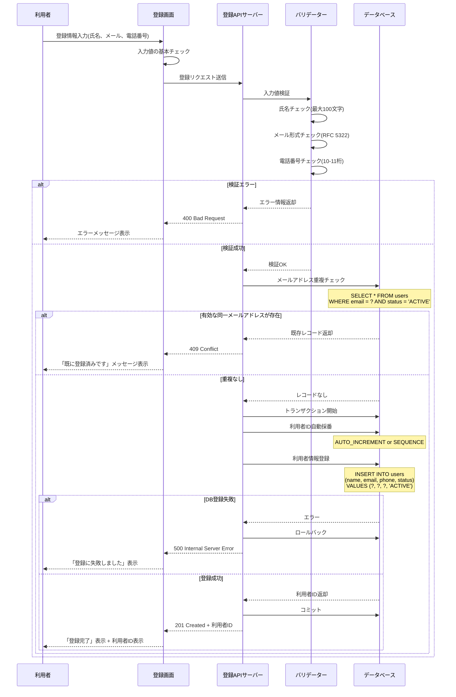

# シーケンス図

> 最終更新: 2026-05-12 21:27
> 生成ツール: SpecFlow（仕様駆動開発アシスタント）

---

```mermaid
sequenceDiagram
    participant U as 利用者
    participant UI as 登録画面
    participant API as 登録APIサーバー
    participant Valid as バリデーター
    participant DB as データベース

    U->>UI: 登録情報入力(氏名、メール、電話番号)
    UI->>UI: 入力値の基本チェック
    UI->>API: 登録リクエスト送信
    
    API->>Valid: 入力値検証
    Valid->>Valid: 氏名チェック(最大100文字)
    Valid->>Valid: メール形式チェック(RFC 5322)
    Valid->>Valid: 電話番号チェック(10-11桁)
    
    alt 検証エラー
        Valid-->>API: エラー情報返却
        API-->>UI: 400 Bad Request
        UI-->>U: エラーメッセージ表示
    else 検証成功
        Valid-->>API: 検証OK
        
        API->>DB: メールアドレス重複チェック
        Note over DB: SELECT * FROM users<br/>WHERE email = ? AND status = 'ACTIVE'
        
        alt 有効な同一メールアドレスが存在
            DB-->>API: 既存レコード返却
            API-->>UI: 409 Conflict
            UI-->>U: 「既に登録済みです」メッセージ表示
        else 重複なし
            DB-->>API: レコードなし
            
            API->>DB: トランザクション開始
            API->>DB: 利用者ID自動採番
            Note over DB: AUTO_INCREMENT or SEQUENCE
            API->>DB: 利用者情報登録
            Note over DB: INSERT INTO users<br/>(name, email, phone, status)<br/>VALUES (?, ?, ?, 'ACTIVE')
            
            alt DB登録失敗
                DB-->>API: エラー
                API->>DB: ロールバック
                API-->>UI: 500 Internal Server Error
                UI-->>U: 「登録に失敗しました」表示
            else 登録成功
                DB-->>API: 利用者ID返却
                API->>DB: コミット
                API-->>UI: 201 Created + 利用者ID
                UI-->>U: 「登録完了」表示 + 利用者ID表示
            end
        end
    end

    %% 仕様参照: docs/specification.md
    %% 生成日時: 2026-05-12 21:23
```
