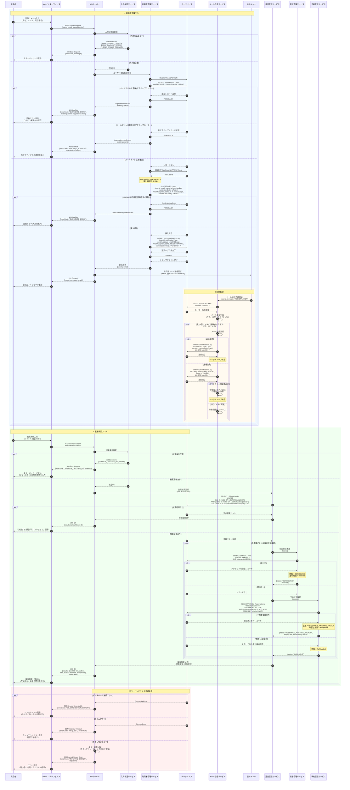

# シーケンス図

> 最終更新: 2026-05-12 23:43
> 生成ツール: SpecFlow（仕様駆動開発アシスタント）

---

```mermaid
sequenceDiagram
    autonumber
    
    %% 1. 利用者登録のシーケンス
    participant 利用者 as 利用者
    participant WebUI as Webインターフェース
    participant API as APIサーバー
    participant Validator as 入力検証サービス
    participant UserService as 利用者管理サービス
    participant DB as データベース
    participant EmailService as メール送信サービス
    participant NotificationQueue as 通知キュー
    
    rect rgb(240, 248, 255)
        Note over 利用者,NotificationQueue: 1. 利用者登録フロー
        
        利用者->>WebUI: 登録フォーム入力<br/>(氏名、メール、電話番号)
        WebUI->>API: POST /users/register<br/>{name, email, phoneNumber}
        
        API->>Validator: 入力値検証要求
        
        alt 入力形式エラー
            Validator-->>API: ValidationError<br/>(NAME_INVALID_LENGTH/<br/>EMAIL_INVALID_FORMAT/<br/>PHONE_INVALID_FORMAT)
            API-->>WebUI: 400 Bad Request<br/>{errorCode, message}
            WebUI-->>利用者: エラーメッセージ表示
        else 入力値正常
            Validator-->>API: 検証OK
            
            API->>UserService: ユーザー登録処理開始
            UserService->>DB: BEGIN TRANSACTION
            
            UserService->>DB: SELECT email FROM Users<br/>WHERE email = ? AND isActive = TRUE
            
            alt メールアドレス重複(アクティブユーザー)
                DB-->>UserService: 既存レコード返却
                UserService->>DB: ROLLBACK
                UserService-->>API: DuplicateEmailError<br/>{existingUserId}
                API-->>WebUI: 409 Conflict<br/>{errorCode: "DUPLICATE_EMAIL",<br/>existingUserId, suggestedAction}
                WebUI-->>利用者: 重複エラー表示<br/>ログイン画面への誘導
                
            else メールアドレス重複(非アクティブユーザー)
                DB-->>UserService: 非アクティブレコード返却
                UserService->>DB: ROLLBACK
                UserService-->>API: InactiveAccountFound<br/>{existingUserId}
                API-->>WebUI: 409 Conflict<br/>{errorCode: "INACTIVE_ACCOUNT",<br/>reactivationOption}
                WebUI-->>利用者: 再アクティブ化の選択肢提示
                
            else メールアドレス未使用
                DB-->>UserService: レコードなし
                
                UserService->>DB: SELECT MAX(userId) FROM Users
                DB-->>UserService: maxUserId
                Note over UserService: newUserId = maxUserId + 1<br/>(または初回なら1)
                
                UserService->>DB: INSERT INTO Users<br/>(userId, email, name, phoneNumber,<br/>registrationDate, isActive)<br/>VALUES (newUserId, ?, ?, normalize(?),<br/>currentDateTime(), TRUE)
                
                alt UNIQUE制約違反(同時登録の競合)
                    DB-->>UserService: DuplicateKeyError
                    UserService->>DB: ROLLBACK
                    UserService-->>API: ConcurrentRegistrationError
                    API-->>WebUI: 409 Conflict<br/>{errorCode: "DUPLICATE_EMAIL"}
                    WebUI-->>利用者: 重複エラー(再試行案内)
                    
                else 挿入成功
                    DB-->>UserService: 挿入完了
                    
                    UserService->>DB: INSERT INTO NotificationLog<br/>(userId, notificationType,<br/>sentAt, status, emailAddress)<br/>VALUES (newUserId, 'REGISTRATION',<br/>currentDateTime(), 'PENDING', ?)
                    DB-->>UserService: 通知ログ作成完了
                    
                    UserService->>DB: COMMIT
                    DB-->>UserService: トランザクション完了
                    
                    UserService-->>API: 登録成功<br/>{userId, email}
                    API->>NotificationQueue: 非同期メール送信要求<br/>{userId, type: 'REGISTRATION'}
                    API-->>WebUI: 201 Created<br/>{userId, message, email}
                    WebUI-->>利用者: 登録完了メッセージ表示
                    
                    %% 非同期メール送信処理
                    rect rgb(255, 250, 240)
                        Note over NotificationQueue,DB: 非同期処理
                        NotificationQueue->>EmailService: メール送信処理開始<br/>{userId, template: 'REGISTRATION'}
                        EmailService->>DB: SELECT * FROM Users<br/>WHERE userId = ?
                        DB-->>EmailService: ユーザー情報取得
                        
                        EmailService->>EmailService: メール本文生成<br/>(件名、本文、ログインURL)
                        
                        loop 最大3回リトライ(指数バックオフ: 1分、2分、4分)
                            EmailService->>EmailService: メール送信試行
                            
                            alt 送信成功
                                EmailService->>DB: UPDATE NotificationLog<br/>SET status = 'SUCCESS',<br/>sentAt = currentDateTime()<br/>WHERE userId = ?
                                DB-->>EmailService: 更新完了
                                Note over EmailService: リトライループ終了
                                
                            else 送信失敗
                                EmailService->>DB: UPDATE NotificationLog<br/>SET retryCount = retryCount + 1,<br/>status = 'FAILED'<br/>WHERE userId = ?
                                DB-->>EmailService: 更新完了
                                
                                alt リトライ上限到達(3回)
                                    EmailService->>EmailService: 管理者アラート送信<br/>(手動対応依頼)
                                    Note over EmailService: リトライループ終了
                                else まだリトライ可能
                                    EmailService->>EmailService: 待機(指数バックオフ)
                                end
                            end
                        end
                    end
                end
            end
        end
    end
    
    %% 2. 蔵書検索のシーケンス
    rect rgb(240, 255, 240)
        Note over 利用者,DB: 2. 蔵書検索フロー
        
        participant BookService as 蔵書管理サービス
        participant LoanService as 貸出管理サービス
        participant ReservationService as 予約管理サービス
        
        利用者->>WebUI: 検索条件入力<br/>(タイトル/著者/ISBN)
        WebUI->>API: GET /books/search?<br/>title=&author=&isbn=
        
        API->>Validator: 検索条件検証
        
        alt 検索条件が空
            Validator-->>API: ValidationError<br/>(SEARCH_CRITERIA_REQUIRED)
            API-->>WebUI: 400 Bad Request<br/>{errorCode: "SEARCH_CRITERIA_REQUIRED"}
            WebUI-->>利用者: エラーメッセージ表示<br/>(少なくとも1つの検索条件を入力)
            
        else 検索条件あり
            Validator-->>API: 検証OK
            
            API->>BookService: 書籍検索実行<br/>{title, author, isbn}
            
            BookService->>DB: SELECT * FROM Books<br/>WHERE<br/>(title IS NULL OR LOWER(title) LIKE ?)<br/>AND (author IS NULL OR LOWER(author) LIKE ?)<br/>AND (isbn IS NULL OR normalizeISBN(isbn) = ?)
            
            alt 検索結果なし
                DB-->>BookService: 空の結果セット
                BookService-->>API: 検索結果0件
                API-->>WebUI: 200 OK<br/>{results: [], totalCount: 0}
                WebUI-->>利用者: 「該当する書籍が見つかりません」表示
                
            else 検索結果あり
                DB-->>BookService: 書籍リスト返却
                
                loop 各書籍ごとに在庫状況を確認
                    BookService->>LoanService: 貸出状況確認<br/>{bookId}
                    LoanService->>DB: SELECT * FROM Loans<br/>WHERE bookId = ?<br/>AND returnedAt IS NULL
                    
                    alt 貸出中
                        DB-->>LoanService: アクティブな貸出レコード
                        Note over LoanService: 状態 = BORROWED<br/>返却期限 = dueDate
                        LoanService-->>BookService: {status: "BORROWED",<br/>dueDate}
                        
                    else 貸出なし
                        DB-->>LoanService: レコードなし
                        
                        BookService->>ReservationService: 予約状況確認<br/>{bookId}
                        ReservationService->>DB: SELECT * FROM Reservations<br/>WHERE bookId = ?<br/>AND status = 'ACTIVE'<br/>AND notificationSentAt IS NOT NULL<br/>ORDER BY priority LIMIT 1
                        
                        alt 予約者受取待ち
                            DB-->>ReservationService: 通知済み予約レコード
                            Note over ReservationService: 状態 = RESERVED_AWAITING_PICKUP<br/>取置き期限 = expiryDate
                            ReservationService-->>BookService: {status: "RESERVED_AWAITING_PICKUP",<br/>expiryDate, reservedByUserId}
                            
                        else 予約なし/通知前
                            DB-->>ReservationService: レコードなしまたは通知前
                            Note over ReservationService: 状態 = AVAILABLE
                            ReservationService-->>BookService: {status: "AVAILABLE"}
                        end
                    end
                end
                
                BookService-->>API: 検索結果リスト<br/>(書籍情報+在庫状況)
                API-->>WebUI: 200 OK<br/>{results: [{bookId, title, author,<br/>isbn, status, dueDate, expiryDate}],<br/>totalCount}
                WebUI-->>利用者: 検索結果一覧表示<br/>(在庫状況、返却予定日等含む)
            end
        end
    end
    
    %% エラーハンドリング
    rect rgb(255, 240, 240)
        Note over API,DB: エラーハンドリング共通処理
        
        alt データベース接続エラー
            DB-->>API: ConnectionError
            API-->>WebUI: 503 Service Unavailable<br/>{errorCode: "DB_CONNECTION_ERROR"}
            WebUI-->>利用者: システムエラー表示<br/>(しばらく待ってから再試行)
            
        else タイムアウト
            DB-->>API: TimeoutError
            API-->>WebUI: 504 Gateway Timeout<br/>{errorCode: "REQUEST_TIMEOUT"}
            WebUI-->>利用者: タイムアウトエラー表示<br/>(再試行を促す)
            
        else 予期しないエラー
            API-->>API: エラーログ記録<br/>(スタックトレース、リクエスト情報)
            API-->>WebUI: 500 Internal Server Error<br/>{errorCode: "INTERNAL_ERROR",<br/>requestId}
            WebUI-->>利用者: エラー表示<br/>(問い合わせ用リクエストID提示)
        end
    end

%% 仕様参照: docs/specification.md
%% 生成日時: 2026-05-12 23:41
```
