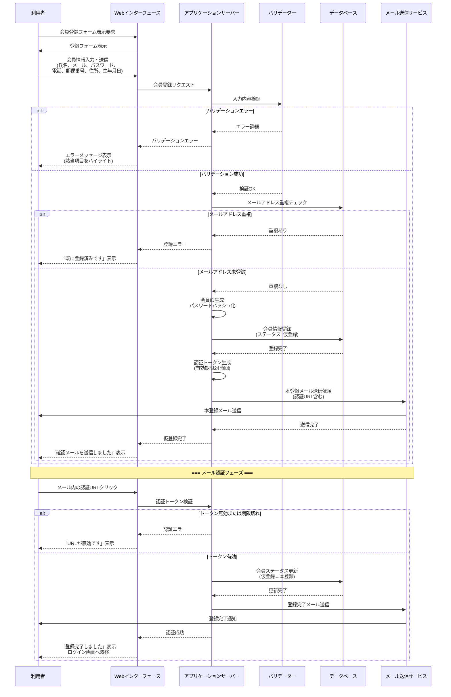

# シーケンス図

> 最終更新: 2026-05-12 23:16
> 生成ツール: SpecFlow（仕様駆動開発アシスタント）

---

```mermaid
sequenceDiagram
    participant User as 利用者
    participant WebUI as Webインターフェース
    participant AppServer as アプリケーションサーバー
    participant Validator as バリデーター
    participant DB as データベース
    participant MailService as メール送信サービス

    User->>WebUI: 会員登録フォーム表示要求
    WebUI->>User: 登録フォーム表示

    User->>WebUI: 会員情報入力・送信<br/>(氏名、メール、パスワード、<br/>電話、郵便番号、住所、生年月日)
    
    WebUI->>AppServer: 会員登録リクエスト
    
    AppServer->>Validator: 入力内容検証
    
    alt バリデーションエラー
        Validator-->>AppServer: エラー詳細
        AppServer-->>WebUI: バリデーションエラー
        WebUI-->>User: エラーメッセージ表示<br/>(該当項目をハイライト)
    else バリデーション成功
        Validator-->>AppServer: 検証OK
        
        AppServer->>DB: メールアドレス重複チェック
        
        alt メールアドレス重複
            DB-->>AppServer: 重複あり
            AppServer-->>WebUI: 登録エラー
            WebUI-->>User: 「既に登録済みです」表示
        else メールアドレス未登録
            DB-->>AppServer: 重複なし
            
            AppServer->>AppServer: 会員ID生成<br/>パスワードハッシュ化
            AppServer->>DB: 会員情報登録<br/>(ステータス: 仮登録)
            DB-->>AppServer: 登録完了
            
            AppServer->>AppServer: 認証トークン生成<br/>(有効期限24時間)
            
            AppServer->>MailService: 本登録メール送信依頼<br/>(認証URL含む)
            MailService->>User: 本登録メール送信
            MailService-->>AppServer: 送信完了
            
            AppServer-->>WebUI: 仮登録完了
            WebUI-->>User: 「確認メールを送信しました」表示
        end
    end

    Note over User,MailService: === メール認証フェーズ ===
    
    User->>WebUI: メール内の認証URLクリック
    WebUI->>AppServer: 認証トークン検証
    
    alt トークン無効または期限切れ
        AppServer-->>WebUI: 認証エラー
        WebUI-->>User: 「URLが無効です」表示
    else トークン有効
        AppServer->>DB: 会員ステータス更新<br/>(仮登録→本登録)
        DB-->>AppServer: 更新完了
        
        AppServer->>MailService: 登録完了メール送信
        MailService->>User: 登録完了通知
        
        AppServer-->>WebUI: 認証成功
        WebUI-->>User: 「登録完了しました」表示<br/>ログイン画面へ遷移
    end

    %% 仕様参照: docs/specification.md
    %% 生成日時: 2026-05-12 23:14
```
