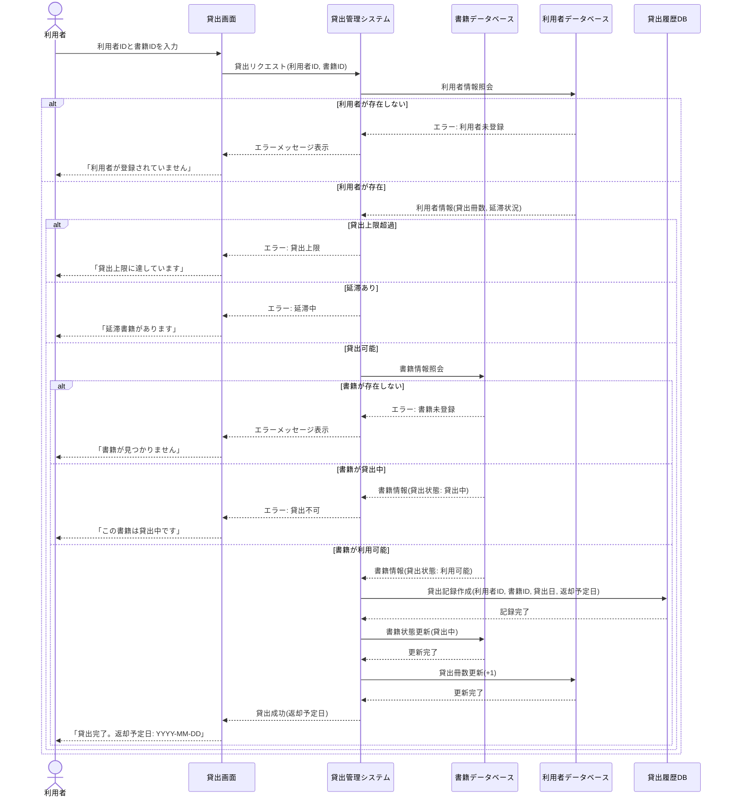

# シーケンス図

> 最終更新: 2026-05-12 19:30
> 生成ツール: SpecFlow（仕様駆動開発アシスタント）

---

```mermaid
sequenceDiagram
    actor 利用者
    participant 貸出画面
    participant 貸出管理システム
    participant 書籍データベース
    participant 利用者データベース
    participant 貸出履歴DB

    利用者->>貸出画面: 利用者IDと書籍IDを入力
    貸出画面->>貸出管理システム: 貸出リクエスト(利用者ID, 書籍ID)
    
    貸出管理システム->>利用者データベース: 利用者情報照会
    
    alt 利用者が存在しない
        利用者データベース-->>貸出管理システム: エラー: 利用者未登録
        貸出管理システム-->>貸出画面: エラーメッセージ表示
        貸出画面-->>利用者: 「利用者が登録されていません」
    else 利用者が存在
        利用者データベース-->>貸出管理システム: 利用者情報(貸出冊数, 延滞状況)
        
        alt 貸出上限超過
            貸出管理システム-->>貸出画面: エラー: 貸出上限
            貸出画面-->>利用者: 「貸出上限に達しています」
        else 延滞あり
            貸出管理システム-->>貸出画面: エラー: 延滞中
            貸出画面-->>利用者: 「延滞書籍があります」
        else 貸出可能
            貸出管理システム->>書籍データベース: 書籍情報照会
            
            alt 書籍が存在しない
                書籍データベース-->>貸出管理システム: エラー: 書籍未登録
                貸出管理システム-->>貸出画面: エラーメッセージ表示
                貸出画面-->>利用者: 「書籍が見つかりません」
            else 書籍が貸出中
                書籍データベース-->>貸出管理システム: 書籍情報(貸出状態: 貸出中)
                貸出管理システム-->>貸出画面: エラー: 貸出不可
                貸出画面-->>利用者: 「この書籍は貸出中です」
            else 書籍が利用可能
                書籍データベース-->>貸出管理システム: 書籍情報(貸出状態: 利用可能)
                
                貸出管理システム->>貸出履歴DB: 貸出記録作成(利用者ID, 書籍ID, 貸出日, 返却予定日)
                貸出履歴DB-->>貸出管理システム: 記録完了
                
                貸出管理システム->>書籍データベース: 書籍状態更新(貸出中)
                書籍データベース-->>貸出管理システム: 更新完了
                
                貸出管理システム->>利用者データベース: 貸出冊数更新(+1)
                利用者データベース-->>貸出管理システム: 更新完了
                
                貸出管理システム-->>貸出画面: 貸出成功(返却予定日)
                貸出画面-->>利用者: 「貸出完了。返却予定日: YYYY-MM-DD」
            end
        end
    end

    %% 仕様参照: docs/specification.md
    %% 生成日時: 2026-05-12 19:16
```
